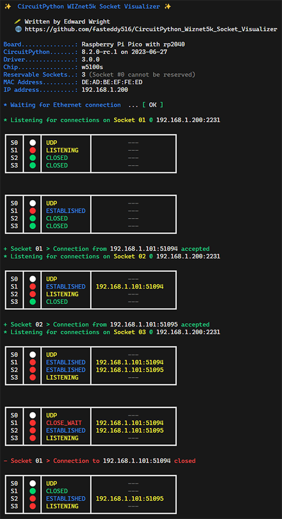

# CircuitPython WIZnet5k Socket Visualizer

###### A tool to help visualize the state of hardware sockets on WIZnet5k chipsets in CircuitPython using Adafruit's WIZnet5k driver.

Written by [Edward Wright](https://github.com/fasteddy516) (fasteddy516).

Available at https://github.com/fasteddy516/CircuitPython_Wiznet5k_Socket_Visualizer

# Description

Socket Visualizer is a [CircuitPython](https://circuitpython.org/) script that was created to help test the [WIZnet5k driver](https://github.com/adafruit/Adafruit_CircuitPython_Wiznet5k) provided by [Adafruit](https://www.adafruit.com/).  It creates a simple server that listens for TCP connections and displays a table in the serial console containing hardware socket status information ('reservation' state, status and connected client) as connections are made and broken.  When clients connect, the server sends a string indicating which hardware socket the client is connected to.  While the client is connected, the server sends out 'heartbeat' strings every 2 seconds.

Below is an example of the Socket Visualizer's output:

# Dependencies

You will need the following CircuitPython drivers to run this script:

* [Adafruit_CircuitPython_BusDevice](https://github.com/adafruit/Adafruit_CircuitPython_BusDevice)
* [Adafruit_CircuitPython_Wiznet5k](https://github.com/adafruit/Adafruit_CircuitPython_Wiznet5k)

   *The easiest way to install these drivers on your CircuitPython device is using Adafruit's [circup tool](https://learn.adafruit.com/keep-your-circuitpython-libraries-on-devices-up-to-date-with-circup/overview).*

* Colors and unicode characters are used in the console output, so be sure to use a terminal application that supports these features.

* While these aren't exactly _dependencies_, it should be noted that this tool was developed and tested using CircuitPython 8.2.0 and Adafruit_CircuitPython_Wiznet5k driver version 3.0.0 on a Raspberry Pi Pico attached to a WIZnet Ethernet Hat with a w5100s chipset.  Output was verified in the [SimplySerial](https://github.com/fasteddy516/SimplySerial) terminal application running in PowerShell on Windows 11.  

   *This tool accesses private variables/properties (`socket._socknum`, `socket._status`, and `WIZNET5K._sockets_reserved`) which are not part of the official driver API and may be changed in driver versions beyond 3.0.0 which would break this tool.*

# Using Socket Visualizer
* Install the dependencies listed above on your CircuitPython device

* Copy [main.py](https://github.com/fasteddy516/CircuitPython_Wiznet5k_Socket_Visualizer/blob/main/main.py) from this repository to your CircuiytPython device.  
   
   *If there is already a `code.py` file on your device, you will need to delete or rename it to allow `main.py` to run.*

* Make sure the variables in the `CONFIGURATION` section (near the top of the script just after all the `import` statements) are set appropriately for your device/environment.

* Connect to the CircuitPython serial console and restart the script.

* Use a tool like [PuTTy](https://www.chiark.greenend.org.uk/~sgtatham/putty/) to connect to your CircuitPython device and watch the socket status update in the serial console.

